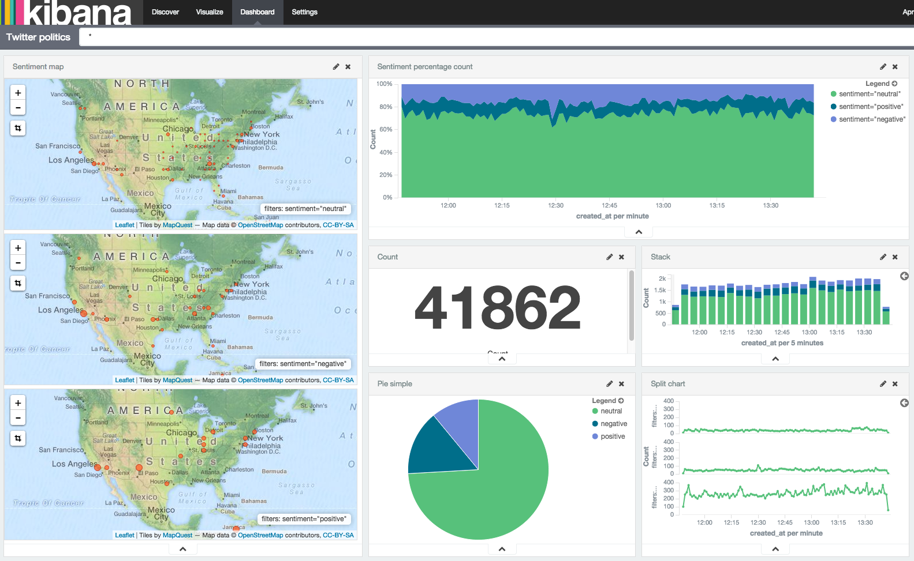

# twitter-politics
A twitter stream filtered by politics topics. The data is streamed into [Apache Spark](https://spark.apache.org/), processed and indexed into [Elasticsearch](https://www.elastic.co/). A simple [sentiment analysis](http://en.wikipedia.org/wiki/Sentiment_analysis) is performed in order to classify tweets as positive/negative. The following screenshot shows [Kibana](https://www.elastic.co/products/kibana) dashboard visualizing the output data:



# Building

To build the application, go to the root dir and type:

```shell
./gradlew clean assemble install
```

# Running

To run the application, build it, set the classpath and invoke the jar:

```shell
java -jar build/libs/twitter-politics-0.1.jar SPARK_MASTER CONSUMER_KEY CONSUMER_SECRET ACCESS_TOKEN ACCESS_TOKEN_SECRET ES_RESOURCE [ES_NODES]
```

You can generate your keys by following the [Twitter Documentation](https://dev.twitter.com/oauth/overview/application-owner-access-tokens)

# Screenshots


